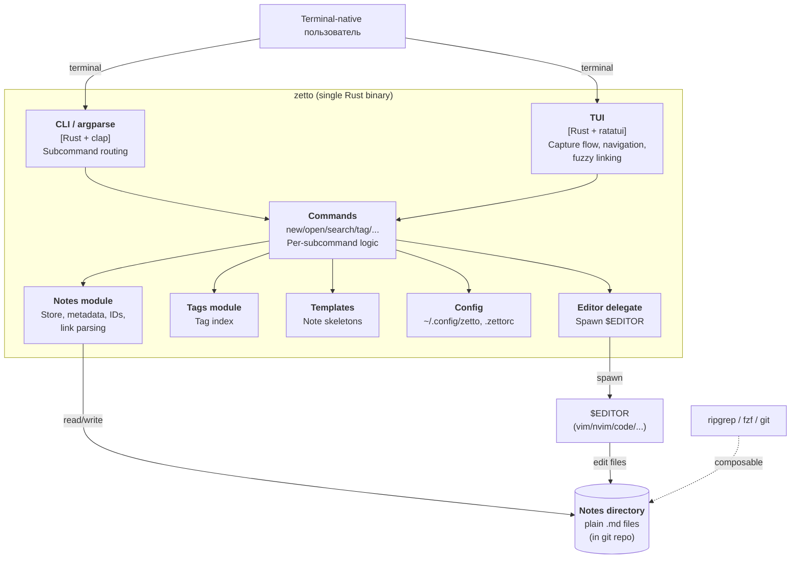

# Architecture

> **What this document is.** The living architectural state of this project — what the system is, what it must satisfy, how it's structured today, what decisions got it here, and what's still open. It is updated whenever any of those things change.
>
> **What it is not.** A design document, a roadmap, or a sales pitch. Keep it short, current, and honest. Stale or aspirational content here is worse than no content.
>
> **How to update it.** Touch this file in the same change as the code/ADR that changes its state. If a section is no longer accurate, fix it now — not "later".

---

## 1. System summary

`zetto` — это CLI/TUI инструмент для ведения базы знаний в формате Zettelkasten, написанный на Rust. Первичный пользователь — terminal-native инженер/исследователь, живущий в vim+tmux+git, который хочет вести граф знаний как plain-text файлы внутри своей цепочки инструментов, а не в тяжёлом GUI типа Obsidian. Система research-grounded: она *принуждает* к Zettelkasten-паттернам (atomic notes, link-before-save, фиксированная ID-схема), а не даёт ещё один настраиваемый markdown-редактор. Заметки живут как plain markdown на диске; продукт композируется с `$EDITOR`, ripgrep, fzf и git, а не переизобретает их.

Проект переименован из `zk` в `zetto` в [ADR-0001](./docs/architecture/decisions/0001-project-name-and-ecosystem-positioning.md) (2026-05-09).

См. [`STRATEGY.md`](./STRATEGY.md) для полного контекста.

---

## 2. Quality attributes

<!-- fill in based on real requirements; ниже — то, что прямо следует из STRATEGY.md метрик -->

| Attribute | Target | Notes |
|---|---|---|
| Capture latency (p50) | <5s end-to-end (`zetto new` → сохранённая связанная заметка) | Метрика из STRATEGY. Бюджет распределён по этапам — см. подтаблицу ниже. |
| Cold start | _TBD_ | Должен быть на порядок ниже Electron-альтернатив. Numerify когда появится baseline. |
| Resource footprint | _TBD_ | Single-binary; RAM/CPU при idle TUI. |
| Throughput на индексации | _TBD_ | Сколько заметок в секунду парсится при cold rebuild графа. Важно для Note graph engine. |
| Availability | N/A | Локальный CLI, не сервис. |
| Durability данных | Zero data loss | Заметки = plain markdown в git. Любая операция должна оставлять рабочий tree в консистентном состоянии. |
| Geographic distribution | N/A | Локальный, single-machine. |

### 2.1 Capture latency budget (распределение по этапам)

Добавлено `/archforge:observe` 2026-05-09 (находка O-8). Общий бюджет <5 с end-to-end (p50) распределён по этапам ниже. Любое решение в A/B/C должно явно указать свой бюджет внутри общего; превышение бюджета этапом — повод для ADR-отклонения.

| Этап | Бюджет (p50) | Зависит от | Примечание |
|---|---|---|---|
| Process startup | <50 ms | Rust binary, no runtime warm-up | На холодном старте (первый запуск в сессии). При активной TUI/демоне — амортизируется до нуля. |
| Index lookup (для линкования) | <100 ms | B1 | Если B1 = in-memory rebuild — этот бюджет нарушается на 1k+ заметок; если persistent или event-sourced — bottleneck не здесь. |
| TUI render & input handling | <200 ms | C3, C4 | Включает рендер picker-а ссылок, инкрементальный фильтр. На прогретом TUI большинство кадров <16 ms. |
| Fuzzy-link picker (поиск кандидатов) | <500 ms | A2, B1, D1 | Самый «латучий» этап; может уйти в delegate (skim/fzf) или в индекс. |
| Constraint check (`link-before-save` etc.) | <100 ms | C2a, C2b | Применяется только в `prep`-режиме при варианте C4=split (см. C4 в decision-map). В `service`-режиме — пропуск. |
| Save (запись на диск + index update) | <300 ms | A5 (versioning), B1 | FS-write идемпотентен; обновление индекса инкрементально. |
| **Reserve** | **~3500 ms** | — | Запас под рассуждение пользователя, реальный набор текста, сетевые задержки sync (если включён через D2). |

Сумма detached-бюджетов системы ≈1250 ms; ≥3500 ms — это user-time, не машинное. Если все системные этапы в сумме превышают 1500 ms на p50 — продукт не достигает метрики STRATEGY на масштабе 1k+ заметок, и одно из решений (B1, C4) подлежит пересмотру.

---

## 3. High-level structure

<!-- C4 Container-level (L2). Pre-filled из истории git и STRATEGY.md; уточняется по ходу work. -->

_Заглушка C4 L2; точные контейнеры/границы фиксируются по мере принятия ADR (особенно после разрешения Open question 3 — индекс)._

L3-детализация конкретных модулей живёт в [`docs/architecture/diagrams/`](./docs/architecture/diagrams/).

---

## 4. Key constraints

- **Team** — соло-разработчик (self-проект).
- **Stack** — Rust (binding constraint, продукт строится как лёгкая нативная альтернатива Electron-решениям).
- **Дистрибуция** — single binary; никаких runtime-зависимостей у пользователя за пределами `$EDITOR`/git.
- **Формат данных** — plain markdown на диске, files-as-graph; никакой проприетарной БД как первичного хранилища (см. STRATEGY → Approach).
- **Operational** — локальный инструмент, без сервера, без cloud-зависимостей.
- **Compliance** — N/A (личные данные пользователя живут в его собственной файловой системе/git).
- **Бюджет / Time** — _TBD_; OSS-проект, темп определяется автором.

---

## 5. Decision index

<!-- ADR-ов пока нет. Первая запись появится после первого `/archforge:cycle` или `/archforge:adr`. -->

| # | Date | Status | Decision |
|---|---|---|---|
| [0004](./docs/architecture/decisions/0004-frontmatter-convention.md) | 2026-05-09 | Accepted | Frontmatter convention: required `id`/`title`; standard optional `tags`/`aliases`/`created`/`updated`; `x-*` for extensions; lenient schema with lint warns; hand-rolled write |
| [0003](./docs/architecture/decisions/0003-link-representation.md) | 2026-05-09 | Accepted | Link representation: wikilink-primary `[[ULID]]` / `[[ULID|display]]`; markdown read-compat; embeds/anchors/block-refs deferred to v2 with triggers |
| [0002](./docs/architecture/decisions/0002-note-id-scheme-and-filename-layout.md) | 2026-05-09 | Accepted | Note ID scheme and filename layout: ULID in YAML frontmatter, `<ULID>-<slug>.md` filename |
| [0001](./docs/architecture/decisions/0001-project-name-and-ecosystem-positioning.md) | 2026-05-09 | Accepted | Rename project from `zk` to `zetto` |

ADR файлы живут в [`docs/architecture/decisions/`](./docs/architecture/decisions/).

---

## 6. Open questions

<!-- 5 seed-вопросов, выявленных при init. Каждый — кандидат на отдельный /archforge:cycle. -->

- ~~**Q1. Схема ID заметок.**~~ — закрыт [ADR-0002](./docs/architecture/decisions/0002-note-id-scheme-and-filename-layout.md): ULID во frontmatter + `<ULID>-<slug>.md` filename.
- ~~**Q2. Синтаксис ссылок.**~~ — закрыт [ADR-0003](./docs/architecture/decisions/0003-link-representation.md): wikilink-primary `[[ULID]]` / `[[ULID|display]]` + canonical markdown read-compat; embeds/anchors/block-refs deferred to v2.
- **Q3. Хранилище графа/индекса.** In-memory rebuild при каждом запуске (zero state, but cold-start cost) vs persistent index (sqlite/sled/JSON sidecar — быстро, но invalidation и sync). Критично для Capture latency и Note graph engine track.
- **Q4. Граница TUI vs CLI-pipe.** Какие операции — только TUI (живая навигация, fuzzy-linking графа) vs композируемые pipe-friendly CLI (`zetto list`, `zetto new`, `zetto lint`). Это контракт Toolchain interop track и определяет, можно ли использовать `zetto` из shell-скриптов и редакторных плагинов.
- **Q5. Степень принуждения constraints.** `zetto new` *блокирует* сохранение без исходящей ссылки vs предупреждает vs только flag в `zetto lint`. Прямой trade-off между Capture latency (быстрее = меньше принуждения) и Orphan-note ratio (строже = ниже orphan rate). Определяет, воспринимается ли Methodology enforcement как помощь или как враждебность.

---

## 7. Anti-patterns to avoid

<!-- Спроектные анти-паттерны, прямо вытекающие из STRATEGY + здравого смысла для Rust CLI. -->

- **Никакой проприетарной БД как первичного хранилища.** Plain markdown на диске — это контракт с пользователем (notes-as-code). Index допустим только как derived state, который можно безопасно удалить и пересобрать.
- **Папки не являются первичной организацией.** Граф строится через ссылки, а не через каталоги (см. STRATEGY → Approach: «отказ от папок-как-таксономии»).
- **Теги не заменяют ссылки.** Теги — facet, ссылки — связи. Если фича позволяет tagging вместо linking — это анти-паттерн.
- **Никакого Electron / web-UI.** Уничтожает основной тезис продукта.
- **Никакого облачного sync как зависимости.** Sync = пользовательский git (или другой механизм поверх файлов). Любое cloud-coupling — анти-паттерн.
- **Не переизобретать ripgrep/fzf/git.** Если задача решается композицией существующих CLI — `zetto` не реализует её сам (см. Track «Toolchain interop»).
- **Никаких mouse-only путей в TUI.** Каждое действие должно иметь keybinding; mouse — опционально.

<!-- Дополнено `/archforge:observe` 2026-05-09 (находка O-12 — формализация trех subject-replacement идей, отвергнутых ideation): -->

- **Только CommonMark + frontmatter как формат заметки.** Никакого org-mode, asciidoc, neorg, custom DSL. STRATEGY фиксирует format choice через ставку на toolchain ubiquity и vim/git-совместимость (не через теоретическую близость к Luhmann). Альтернативные форматы регулярно всплывают как «более research-grounded» и должны быть закрыты этой записью.
- **Single-author по дизайну в v1.** Multi-author / collaborative-vault — отложено в `decision-map.md`, не запрещено навсегда; но *архитектурное проектирование под multi-author с первого дня* — анти-паттерн, потому что переусложняет на ровном месте (см. ideation 2026-05-09 rejection F3.5).
- **CLI-first; редакторские плагины и LSP — обёртки, не первичная форма.** Идея «начать как nvim-плагин или Obsidian-плагин» (ideation rejection F3.1, F6.5) сворачивает идентичность terminal-native инструмента и завязывает архитектуру на конкретный редактор/GUI. Плагины и LSP — легитимные surface'ы (см. C5 в decision-map), но не вместо CLI.

<!--
Примеры дополнительных анти-паттернов добавлять по мере появления решений:
- _e.g., No async для disk I/O если sync хватает — лишняя сложность._
- _e.g., No global mutable state в core lib — TUI/CLI должны быть тонкими адаптерами._
-->
