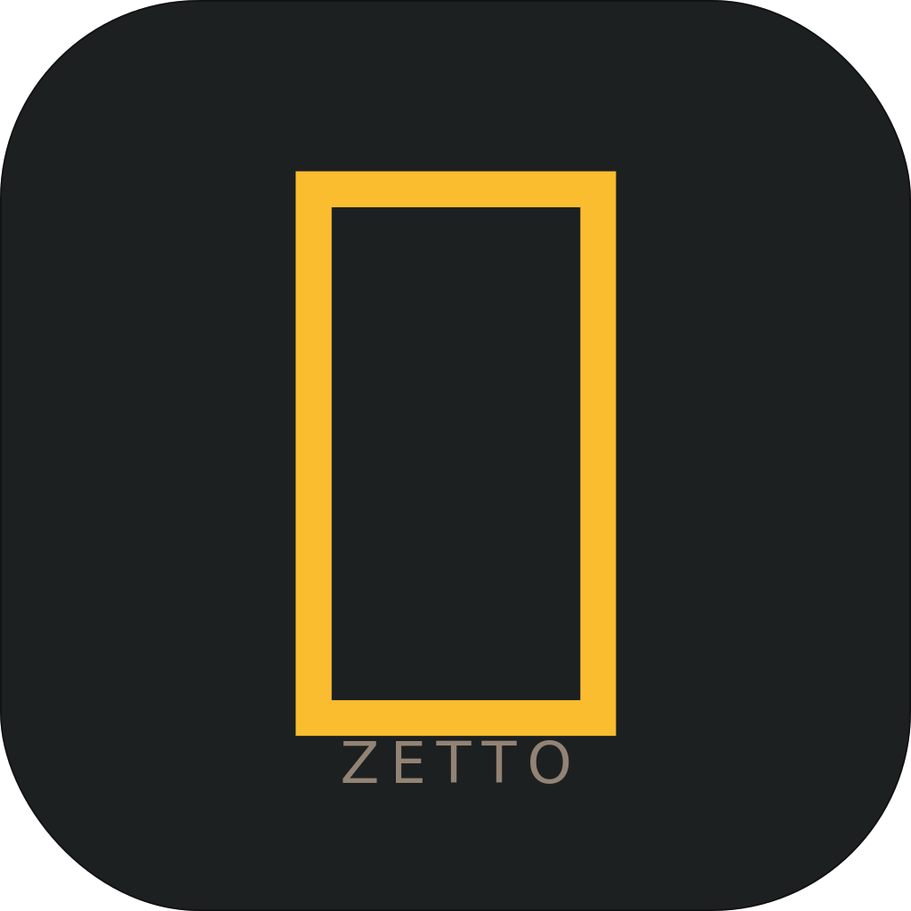

<div align="right">

[English](./README.md) · **Русский**

</div>

<p align="center">
  
</p>

<h1 align="center">zetto</h1>

<p align="center">
  <strong>Terminal-native CLI/TUI для ведения базы знаний в формате Zettelkasten, на Rust.</strong>
</p>

<p align="center">
  
  &nbsp;
  <a href="./LICENSE"></a>
  &nbsp;
  
  &nbsp;
  <a href="./docs/architecture/decisions/"></a>
</p>

<p align="center">
  Прежнее имя — <code>zk</code>. Переименован в <a href="./docs/architecture/decisions/0001-project-name-and-ecosystem-positioning.md">ADR-0001</a> (2026-05-09).
</p>

---

> ### ⚠️ Состояние: pre-alpha, фаза архитектурного проектирования
>
> Рабочее дерево намеренно пустое. Проект сейчас в фазе структурированного архитектурного проектирования до того, как написан код: стратегия, архитектура, карта решений и adversarial-ideation фиксируются первыми.
>
> Текущее состояние — в [`STRATEGY.md`](./STRATEGY.md), [`ARCHITECTURE.md`](./ARCHITECTURE.md) и [`docs/architecture/decision-map.md`](./docs/architecture/decision-map.md).

## Зачем zetto?

Zettelkasten-инструмент для terminal-native инженеров, которые уже живут в vim+tmux+git и хотят, чтобы их граф знаний жил рядом с кодом как plain markdown — а не в отдельном GUI-приложении вроде Obsidian.

Поведение продукта диктуется доказанными паттернами Zettelkasten (Luhmann, Ahrens):

- **Atomic notes.** Один концепт на заметку.
- **Link-before-save.** Заметка обязана подключаться к существующему графу на этапе записи, а не потом.
- **Фиксированная ID-схема.** У каждой заметки стабильный идентификатор, переживающий переименования.
- **Никаких папок-как-таксономии.** Структура возникает из ссылок, а не из каталогов.
- **Теги не заменяют ссылки.** Теги описывают; ссылки соединяют.

Инструмент композируется с `$EDITOR`, ripgrep, fzf и git, а не переизобретает их.

Полный контекст — в [`STRATEGY.md`](./STRATEGY.md).

## Замечание об имени

`zetto` — производное от немецкого *Zettel* (карточка), корня самой Zettelkasten-методологии. В японском языке ゼット (zetto) — это и способ произнесения латинской буквы «Z»; иконка приложения подхватывает этот культурный якорь — символ ゼ (слог «дзэ», ближайший к «Z») в её центре.

Проект переименован из `zk` в `zetto` в [ADR-0001](./docs/architecture/decisions/0001-project-name-and-ecosystem-positioning.md), чтобы избежать путаницы с [zk-org/zk](https://github.com/zk-org/zk) — действующим Go-CLI для Zettelkasten в той же нише (~2,6k★). У проектов разные цели:

|                | zk-org/zk                                                       | **zetto** (этот проект)                                           |
| -------------- | --------------------------------------------------------------- | ----------------------------------------------------------------- |
| **Методология** | нейтральный — сироты, глубокие папки, свободные теги разрешены | принуждающий — research-grounded ограничения на этапе записи      |
| **Стек**       | Go                                                              | Rust                                                              |
| **Лицензия**   | GPLv3                                                           | MIT                                                               |

Результаты поиска по `zk` до мая 2026 года всё ещё ведут сюда — GitHub автоматически перенаправляет с `IgorKramar/zk`.

## Порядок чтения

Если хочется понять, куда это идёт, читай в этом порядке:

1. [`STRATEGY.md`](./STRATEGY.md) — что такое zetto, кому он, ключевые метрики, треки работы.
2. [`ARCHITECTURE.md`](./ARCHITECTURE.md) — системная сводка, нефункциональные требования (включая разложение бюджета задержек по этапам), ограничения, анти-паттерны, открытые вопросы.
3. [`docs/architecture/decision-map.md`](./docs/architecture/decision-map.md) — открытые архитектурные решения в четырёх группах (контракт на диске, внутренности движка, поверхность/UX, interop и экосистема) с зависимостями и предложенным порядком.
4. [`docs/ideation/`](./docs/ideation/) — результаты brainstorming-проходов и фильтрации идей, питающие решения.
5. [`docs/architecture/decisions/`](./docs/architecture/decisions/) — принятые ADR-ы.
6. [`docs/architecture/research/`](./docs/architecture/research/) — discovery-, design- и observation-отчёты.

## Почему рабочее дерево пустое

В этом репозитории была прежняя реализация — `Cargo.toml`, `src/{cli,commands,notes,tags,templates,tui,editor,config}`, с UUID-ID, YAML-frontmatter, графом на HashMap в памяти, поиском по тегам/заголовку/содержимому/regex/glob, делегированием редактору vim/nvim/code/emacs. Последний реальный коммит (`293a1e4 feat: add tui style`, ноябрь 2024) сохранён в git-истории.

Та реализация — это спайк (пробный код): полезен как опыт, но выбор, в неё заложенный, был сделан до того, как написан `STRATEGY.md`. После того как стратегия артикулирована (research-grounded constraints, методология как lint, terminal-native распространение), прежняя реализация перестала соответствовать предполагаемому продукту. Она намеренно не в рабочем дереве; редизайн начинается от архитектуры, а не от рефакторинга кода.

Чтобы посмотреть прежний файл как исторический prior-art:

```sh
git show 293a1e4:src/notes/store.rs | less
git show 293a1e4:src/cli/mod.rs    | less
```

Коммиты до `293a1e4` — часть исторического следа; ничего из периода до архитектурного reset-а не трактуется как контракт.

## Каркас проекта

Репозиторий использует два дополняющих плагина Claude Code, ведущих архитектурную и фичевую работу:

- **[`archforge`](https://github.com/IgorKramar/archforge-marketplace)** — архитектурный цикл (Discover → Research → Design → Decide → Document → Review). Все архитектурные решения живут в `docs/architecture/`.
- **`compound-engineering`** — рабочий цикл уровня фичи (Brainstorm → Plan → Work → Review → Compound). Артефакты уровня фичи живут в `docs/{ideation,brainstorms,plans,solutions}/`.

Правила чередования (когда один цикл передаёт другому) — в [`AGENTS.md`](./AGENTS.md).

## Вклад

Пока не открыто для внешних PR — архитектурная работа структурированная и одно-авторская. После того как первые ADR-ы будут приняты и опубликована спецификация формата (`format-v1`), эта секция будет расширена руководством по setup-у и потоком вкладов.

Если проект интересен в текущем состоянии — самая полезная обратная связь сейчас по открытым вопросам в [`decision-map.md`](./docs/architecture/decision-map.md).

## Лицензия

[MIT](./LICENSE) © 2026 Igor Kramar.

Лицензия для спецификации формата на диске (`format-v1`) — отдельное решение, которое будет принято при публикации спецификации; см. запись **A5** в [`decision-map.md`](./docs/architecture/decision-map.md).

<p align="center">
  <sub>Сделано с <a href="https://github.com/anthropics/claude-code">Claude Code</a> ·
  архитектура — <a href="https://github.com/IgorKramar/archforge-marketplace">archforge</a> ·
  рабочий процесс — <a href="https://github.com/EveryInc/compound-engineering">compound-engineering</a></sub>
</p>
